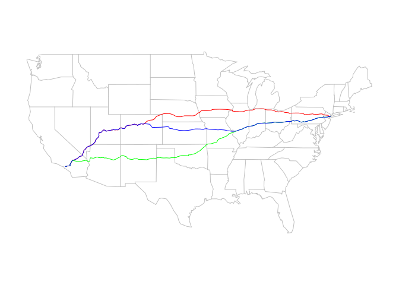

<!-- README.md is generated from README.Rmd. Please edit that file -->
[](https://cran.r-project.org/package=mapsapi)

[](https://cran.r-project.org/package=mapsapi)

mapsapi
=======

`mapsapi` provides an interface to the Google Maps APIs, currently three of them -

-   <a href="https://developers.google.com/maps/documentation/directions/" target="_blank">Google Maps Direction API</a>
-   <a href="https://developers.google.com/maps/documentation/distance-matrix/" target="_blank">Google Maps Distance Matrix API</a>
-   <a href="https://developers.google.com/maps/documentation/geocoding/" target="_blank">Google Maps Geocode API</a>

Functions `mp_directions`, `mp_matrix` and `mp_geocode` are used to access the APIs. They return an `xml_document` object (package `xml2`) with the response contents.

-   Given a *directions* response, functions `mp_get_routes` and `mp_get_segments` can be used to process the response document into a spatial layer. Function `mp_get_routes` gives each alternative as a separate line, while function `mp_get_segments` gives each segment (that is, a portion of the route associated with specific driving instructions) as a separate line.

-   Given a *distance matrix* response, function `mp_get_matrix` can be used to obtain distance/duration matrices.

-   Given a *geocode* response, functions `mp_get_points` and `mp_get_bounds` can be used to obtain geocoded locations as a point or polygon (bounds) layer.

Installation
------------

You can install `mapsapi` from CRAN with -

``` r
install.packages("mapsapi")
```

Or from GitHub with -

``` r
# install.packages("devtools")
devtools::install_github("michaeldorman/mapsapi")
```

Example
-------

The following code section obtains (and plots) the driving directions from New-York to Los Angeles -

``` r
library(mapsapi)

# Get routes (XML document)
doc = mp_directions(
  origin = "New-York",
  destination = "Los Angeles",
  alternatives = TRUE
)
#> https://maps.googleapis.com/maps/api/directions/xml?origin=New-York&destination=Los Angeles&mode=driving&alternatives=true

# Extract lines 'sf' layer
r = mp_get_routes(doc)

# Plot
library(maps)
library(sf)
#> Linking to GEOS 3.5.1, GDAL 2.2.2, proj.4 4.9.2

map("state", fill = FALSE, col = "grey")
plot(st_geometry(r), col = c("red", "green", "blue"), add = TRUE)
```


